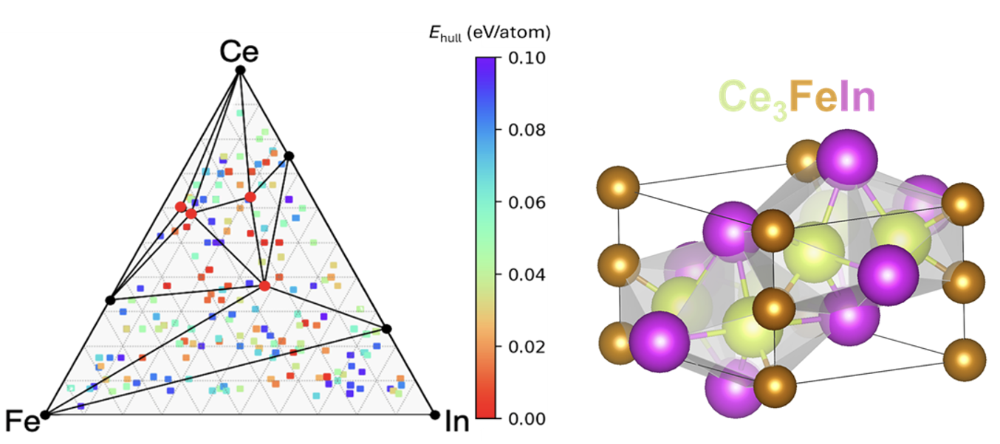
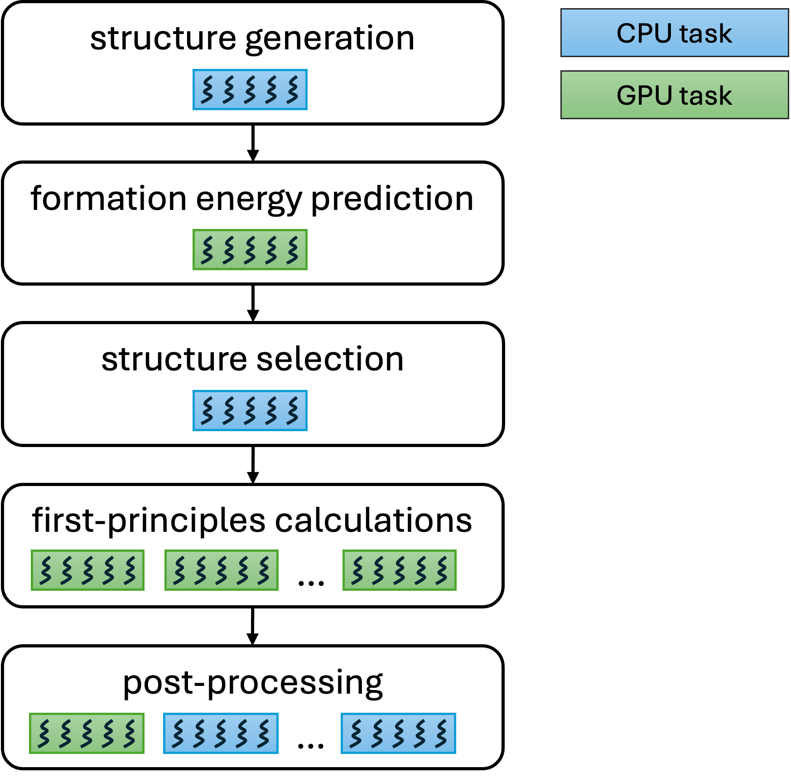

# Summary

exa-AMD is a Python-based application designed to accelerate the discovery and design of functional materials by integrating AI/ML tools, materials databases, and quantum mechanical calculations into scalable, high-performance workflows. The execution model of exa-AMD relies on Parsl [@babuji2019parsl], a task-parallel programming library that enables a flexible execution of tasks on any compute resource from laptops to supercomputers. exa-AMD provides the following key-features:

- **Scalability:** exa-AMD scales efficiently from a single workstation to many supercomputer nodes (internal benchmarks demonstrated near-linear speed-up on up to 128 GPUs or 4,096 CPUs). 
- **Elasticity:** computing resources can be added or released at run time, allowing the workflow to exploit shared supercomputers efficiently and assign dynamically specialized accelerators (e.g., GPUs) to tasks that need them.
- **Modularity:** exa-AMD tracks which tasks have completed, enabling a follow-on run to resume at the next unfinished step.
- **Configurability:** exa-AMD exposes high-level parameters allowing the users to balance performance and accuracy for their scientific objectives. In particular, the workflow supports multinary systems.

{ width=100%}

# Statement of Need

High-performance functional materials are critical for advanced technology innovation and sustainable development. However, the pace of discovery and design of novel functional materials is far behind the demands. Currently known crystalline compounds in some established experimental and computational crystal structure databases represent a small fraction of possible compounds that can be formed by combinations of various chemical compositions and crystalline lattices. As such, the potential for the discovery of new functional materials (especially those containing three or more elements) is profound.

Materials discovery is a time-consuming and computationally expensive process. While the community has access to high-quality simulation tools, machine learning models, and materials databases, integrating these components into a cohesive and scalable workflow remains  a challenge, especially on large-scale systems. 

exa-AMD addresses this need by providing a modular and configurable workflow that connects multiple computational techniques specific to materials discovery in a unified workflow. It supports heterogeneous execution across multiple node types and enables high-throughput processing of structure candidates. By using Parsl, exa-AMD is able to decouple the workflow logic from execution configuration, and therefore it empowers researchers to scale their workflows without having to reimplement them for each system.

# Workflow Overview

{ width=80%}

exa-AMD employs a four-stage workflow, illustrated in Figure 2. Each stage may initiate multiple asynchronous tasks that can execute concurrently. These tasks utilize shared-memory parallelism, either through multi-threading on the CPU (shown in blue in the figure) or by offloading computationally intensive kernels to the GPU (shown in green). The workflow starts with the generation of hypothetical crystal structures. In this step, target elements are substituted into existing crystal structures, creating chemically plausible candidates for further analysis. The next stage involves evaluating them using a Crystal Graph Convolutional Neural Network (CGCNN) model [@Xie2018], which efficiently predicts their formation energies. Structures with low predicted formation energies are selected as promising candidates for further study. This step enables high-throughput screening and prioritization, reducing the computational cost of subsequent calculations. Following CGCNN screening, a filtering stage removes duplicate or near-duplicate structures, based on a structural similarity threshold. Finally, the filtered set of structures is subjected to first-principles calculations using Density Functional Theory (DFT), with the VASP package [@Kresse1996a;@Kresse1996b].

# Initial Crystal Structures
exa-AMD requires an initial set of crystal structures used as starting points in the workflow. For investigations involving any multinary systems, the input dataset can be populated with any relevant set of initial structures, including quaternary prototypes or user-defined entries, and from one or multiple database sources (including but not limited to Materials Project [@Jain2013], GNoME [@Merchant2023], AFLOW [@Curtarolo2012], OQMD [@Saal2013;@Kirklin2015], etc). This flexibility allows the workflow to be adapted to a wide range of compositional and structural spaces.

# Acknowledgements
This work was supported by the U.S. Department of Energy through the Los Alamos National Laboratory. Los Alamos National Laboratory is operated by Triad National Security, LLC, for the National Nuclear Security Administration of U.S. Department of Energy (Contract No. 89233218CNA000001). Any opinions, findings, and conclusions or recommendations expressed in this material are those of the authors and do not necessarily reflect the views of the U.S. Department of Energy’s National Nuclear Security Administration.

# References