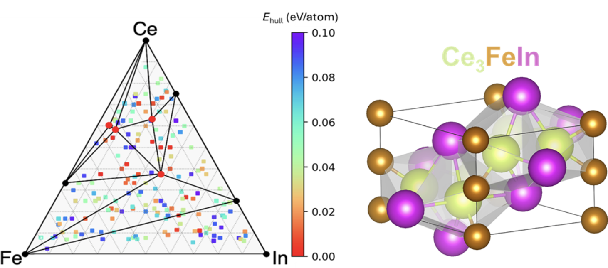

# Summary
<!-- (A summary describing the high-level functionality and purpose of the software for a diverse, non-specialist audience.) -->

exa-AMD is a Python framework designed to accelerate the discovery and design of functional materials. The framework uses Parsl to build customizable and automated workflows that connect AI/ML tools, material databases, quantum mechanical calculations, and state-of-the-art computational methods for novel structure prediction. exa-AMD was designed to scale up on high-performance computing systems including supercomputers equipped with accelerators, such as the Nvidia and AMD GPUs.

It comes with a flexible configuration system based on a global registry. You can choose which Parsl configuration to load at runtime by setting the parsl_config key in the global configuration.It is also possible to create new configs simply by creating a new file in the parsl_configs directory and registering it.

Prediction of new CeFeIn compounds using this framework.
{ width=50% }

Parsl [@babuji2019parsl]

# Statement of need
<!-- (Section that clearly illustrates the research purpose of the software and places it in the context of related work.) -->

# Acknowledgements

# References