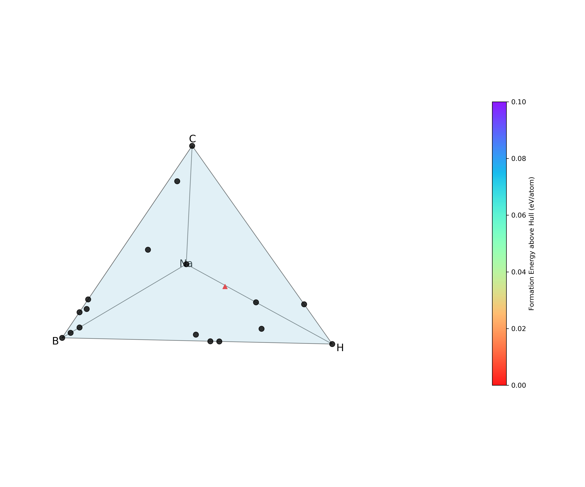

Tutorial
========

This tutorial demonstrates how to build and run **exa-AMD** on the GPU partition of the `Perlmutter supercomputer <https://docs.nersc.gov/systems/perlmutter/architecture/>`_ to predict novel ``Na–B–H–C`` quaternary compounds.

1. Clone the Repository
------------------------

Start by cloning the `exa-AMD` repository:

.. code-block:: bash

   git clone https://github.com/ML-AMD/exa-amd.git
   cd exa-amd

----

2. Install Dependencies
------------------------

CLI install:

.. code-block:: bash

   pip install "https://github.com/ML-AMD/exa-amd/releases/download/v0.1.0/exa_amd-0.1.0-py3-none-any.whl"

Verify the CLI is available:

.. code-block:: bash

   exa_amd --help

----

3. Prepare the Data and VASP Setup
-----------------------------------

Ensure you have a working `VASP <https://www.vasp.at>`_ installation and access to the latest PAW potentials containing kinetic energy densities for meta-GGA calculations .

If you do not already have it:

- Log into your account on the `VASP website <https://www.vasp.at>`_
- Navigate to the "Downloads" section
- Download the latest archive (e.g., potpaw_PBE.52.tar.gz)

Once downloaded, extract the archive and place the resulting `potpaw_PBE` directory anywhere on your system. You will reference its location in your JSON config using the ``vasp_pot_dir`` parameter.

Next, `download <https://iastate.box.com/s/3swro78kbcd69fwamhk7df4n5rx4edae>`_ and extract the **initial_structures** dataset which contains a set of initial crystal structures used by the workflow.

4. Prepare the JSON Configuration File
---------------------------------------

Copy the default Perlmutter configuration:

.. code-block:: bash

   cp configs/perlmutter_quaternary.json configs/my_config_perlmutter.json

Edit the following fields in `my_config_perlmutter.json`:

- ``cms_dir:`` Absolute path to your `cms_dir` directory
- ``work_dir``: A scratch directory for intermediate files
- ``vasp_work_dir``: A work directory for running VASP calculations
- ``vasp_pot_dir``: Path to your `potpaw_PBE` directory
- ``initial_structures``: Path to the `initial_structures` directory (downloaded in the previous section)
- ``post_processing_output_dir``:  Absolute path to the directory that will store every post-processing artifact. If this key is omitted or left empty, the entire post-processing stage is skipped.
- ``mp_rester_api_key``: your Materials Project API key (see https://docs.materialsproject.org). This key is mandatory whenever `post_processing_output_dir` is provided.

----

5. Prepare the Parsl Configuration
-----------------------------------

Parsl configurations must be placed inside the ``parsl_configs/`` directory so that they can be automatically discovered by exa-AMD at runtime.

Start by copying the default Perlmutter configuration:

.. code-block:: bash

   cp parsl_configs/perlmutter.py parsl_configs/my_perlmutter.py

Then edit `my_perlmutter.py`:

a. Change the registration name
~~~~~~~~~~~~~~~~~~~~~~~~~~~~~~~

At the bottom of the file, update `register_parsl_config()` to reflect the new config name. This value **have to match** the value you will set in your JSON config file (the ``parsl_config`` field).

.. code-block:: python

   # Before:
   register_parsl_config("perlmutter_premium", PerlmutterConfig)

   # After:
   register_parsl_config("my_perlmutter", PerlmutterConfig)

b. Update each executor
~~~~~~~~~~~~~~~~~~~~~~~

The Perlmutter configuration defines **five separate executors**:

- Three that run on **GPU nodes** (for VASP and CGCNN tasks)
- Two that run on **CPU nodes** (for structure generation and selection)

For each executor, update the following fields in the `SlurmProvider`:

- `account`: your NERSC allocation account (e.g., **m1234**)
- `qos`: the QOS for that job (e.g., **regular**, **premium**)

.. code-block:: text

   The account and qos values used in the Parsl configuration are exactly the same
   as the ones you would provide when running with Slurm directly on Perlmutter,
   using commands like salloc, srun, or sbatch.

   For example, if you normally run:
     salloc -A m1234 -q regular -C gpu

   Then in your Parsl config, you should use:
     account="m1234"
     qos="regular"
     constraint="gpu"

Here is an example:

.. code-block:: python

   provider=SlurmProvider(
       account="your_gpu_account",    # ← CHANGE ACCORDINGLY
       qos="your_gpu_qos",            # ← CHANGE ACCORDINGLY
       constraint="gpu",
       ...
   )

.. note::

   The account can also be specified at runtime via the command-line arguments.

Make sure you update **all five** executors accordingly, using your appropriate account and qos for CPU and GPU resources.

.. important::

   All Parsl configuration files **must be placed inside the** ``parsl_configs/`` **directory**.

For details on Parsl configuration options, see the `official documentation <https://parsl-project.org>`_.

c. Update JSON Configuration
~~~~~~~~~~~~~~~~~~~~~~~~~~~~~~~~~

After registering the new Parsl configuration, update your JSON config file to reference it:

.. code-block:: text

   {
        ...
       "parsl_config": "my_perlmutter"
   }

exa-AMD will now automatically discover and use the `my_perlmutter` configuration at runtime.

----

6. Run the Workflow
---------------------

Once everything is configured, run the full exa-AMD workflow from a login node of Perlmutter:

.. code-block:: bash

   export PYTHONPATH=$(pwd):$PYTHONPATH
   exa_amd --config configs/my_config_perlmutter.json --vasp_nnodes 2

This will launch the five stages:

1. :func:`~parsl_tasks.gen_structures.generate_structures` — structure generation
2. :func:`~parsl_tasks.cgcnn.run_cgcnn` — formation energy prediction
3. :func:`~parsl_tasks.cgcnn.select_structures` — structure selection
4. :func:`~parsl_tasks.vasp.vasp_calculations` — first-principles calculations
5. :func:`~parsl_tasks.hull.cmd_convex_hull_color` — post-processing

Progress and logs will be printed to stdout/stderr.

.. admonition:: Post-processing workflow
   :class: info

   The post-processing step involves multiple substeps:

   #. **Collection of results:** Gather relaxed crystal structures and total
      energies from each VASP directory. For magnetic systems, the magnetic
      moments are also parsed and stored.

   #. **Formation-energy evaluation & convex-hull construction:** Compute the
      formation energy of every structure relative to reference elemental
      phases, then build (or update) the convex hull for the chemical system.
      Structures on or near the hull are considered potentially stable; those
      far above the hull are deemed metastable or unstable.

   #. **Selection of promising structures:** Identify and copy the candidate structures
      to a dedicated folder for deeper analysis or experimental follow-up.

   #. **Visualization:** Generate an updated phase diagram that plots the
      convex hull and highlights all computed structures.

----

7. Check the Results
---------------------

After the workflow completes, you should verify that all stages ran successfully by inspecting
the contents of the work directory (`work_dir`), the VASP work directory (`vasp_work_dir`) and the post-processing directory (`post_processing_output_dir`).

a. Work directory
~~~~~~~~~~~~~~~~~

Inside your specified `work_dir`, you should see a subdirectory named after the elements string (i.e., `Na-B-C`) with the following contents:

.. code-block:: text

   work_dir/
   └── Na-B-H-C
       ├── new/ 
       ├── POTCAR 
       ├── structures/ 
       └── test_results.csv

b. VASP Directory
~~~~~~~~~~~~~~~~~~

Your `vasp_work_dir` should contain subfolders for VASP calculation outputs and a temporary workspace used during post-processing.

.. code-block:: text

   vasp_work_dir/
   └── Na-B-H-C
       ├── 1/
       ├── 2/
       ├── 3/
       ├── ...
       ├── 10/
       ├── energy.dat
       ├── mp_int_stable.dat
       ├── stable_phases_work_dir/
       └── vasp_calc_result.csv

Each numbered folder corresponds to a VASP calculation for a selected structure.

c. Final Output
~~~~~~~~~~~~~~~

The post-processing output directory should look like the following:

.. code:: text

   post_processing_out_dir/
   ├── hull.dat
   ├── hull_plot.png         # convex-hull phase diagram
   ├── mp_int_stable.dat
   ├── NaBHC_quaternary.csv
   └── selected/             # candidate structures

   **Figure –** The *hull_plot.png* file listed above, showing the
   convex-hull phase diagram generated in this final step.

Your run have to produce this same **hull_plot.png**.